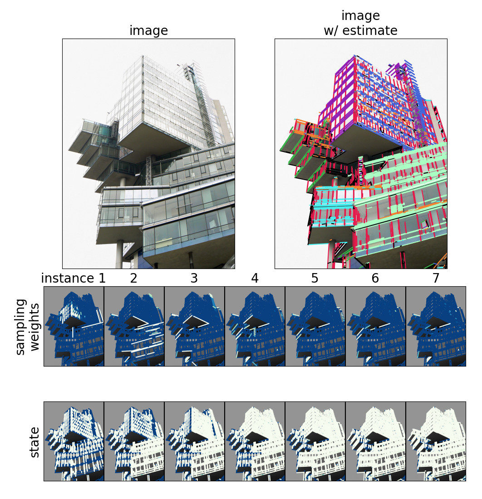

# CONSAC: Robust Multi-Model Fitting by Conditional Sample Consensus

[](https://www.youtube.com/watch?v=Fl_LXtC7A2E "CONSAC CVPR teaser video")

If you use this code, please cite [our paper](https://arxiv.org/abs/2001.02643):
```
@inproceedings{kluger2020consac,
  title={CONSAC: Robust Multi-Model Fitting by Conditional Sample Consensus},
  author={Kluger, Florian and Brachmann, Eric and Ackermann, Hanno and Rother, Carsten and Yang, Michael Ying and Rosenhahn, Bodo},
  booktitle={Proceedings of the IEEE Conference on Computer Vision and Pattern Recognition (CVPR)},
  year={2020}
}
```

Related repositories:
* [NYU-VP dataset](https://github.com/fkluger/nyu_vp)
* [YUD+ dataset](https://github.com/fkluger/yud_plus)

## Installation
Get the code:
```
git clone --recurse-submodules https://github.com/fkluger/consac.git
cd consac
git submodule update --init --recursive
```

Set up the Python environment using [Anaconda](https://www.anaconda.com/): 
```
conda env create -f environment.yml
source activate consac
```

Build the [LSD line segment detector](https://www.ipol.im/pub/art/2012/gjmr-lsd/) module(s):
```
cd datasets/nyu_vp/lsd
python setup.py build_ext --inplace
cd ../../yud_plus/lsd
python setup.py build_ext --inplace
```
For the demo, OpenCV is required as well:
```
pip install opencv-contrib-python==3.4.0.12
```

## Datasets
### NYU-VP
The vanishing point labels and pre-extracted line segments for the 
[NYU dataset](https://cs.nyu.edu/~silberman/datasets/nyu_depth_v2.html) are fetched automatically via the *nyu_vp* 
submodule. In order to use the original RGB images as well, you need to obtain the original 
[dataset MAT-file](http://horatio.cs.nyu.edu/mit/silberman/nyu_depth_v2/nyu_depth_v2_labeled.mat) and convert it to a 
*version 7* MAT-file in MATLAB so that we can load it via scipy:
```
load('nyu_depth_v2_labeled.mat')
save('nyu_depth_v2_labeled.v7.mat','-v7')
```

### YUD and YUD+
Pre-extracted line segments and VP labels are fetched automatically via the *yud_plus* submodule. RGB images and camera 
calibration parameters, however, are not included. Download the original York Urban Dataset from the 
[Elder Laboratory's website](http://www.elderlab.yorku.ca/resources/york-urban-line-segment-database-information/) and 
store it under the ```datasets/yud_plus/data``` subfolder. 


### AdelaideRMF
The AdelaideRMF dataset can be obtained from [Hoi Sim Wong's website](https://cs.adelaide.edu.au/~hwong/doku.php?id=data).

### SfM data
We use the same pre-computed SIFT features of structure-from-motion datasets for self-supervised training on homography 
estimation which were also used for [NG-RANSAC](https://github.com/vislearn/ngransac). You can obtain them via:
```
cd datasets
wget -O traindata.tar.gz https://cloudstore.zih.tu-dresden.de/index.php/s/Gj28LoQjkf9qO5c/download
tar -xzvf traindata.tar.gz
rm traindata.tar.gz
```
Refer to the NG-RANSAC documentation for details about the dataset.

## Demo

### Homography Estimation
For a homography estimation demo, run:
```
python demo.py --problem homography --defaults 
```
You should get a result similar to this:


### Vanishing Point Estimation
For a vanishing point estimation demo, run:
```
python demo.py --problem vp --defaults 
```
You should get a result similar to this:


You can also use your own images as input. Check ```python demo.py --help``` for a list of user-definable parameters.

## Evaluation
In order to repeat the main experiments from our paper using pre-trained neural networks, you can simply run the following commands:

### Vanishing Points
CONSAC on NYU-VP:
```
python evaluate_vp.py --dataset NYU --dataset_path ./datasets/nyu_vp/data --nyu_mat_path nyu_depth_v2_labeled.v7.mat --runcount 5 
```
CONSAC on YUD+:
```
python evaluate_vp.py --dataset YUD+ --dataset_path ./datasets/yud_plus/data --runcount 5 
```
CONSAC on YUD:
```
python evaluate_vp.py --dataset YUD --dataset_path ./datasets/yud_plus/data --runcount 5 
```
For Sequential RANSAC instead of CONSAC, just add the ```--uniform``` option. 

##### Ablation Studies 
For CONSAC-S (trained in a self-supervised manner), add ```--ckpt models/consac-s_vp.net```. 

For CONSAC-S without IMR, add ```--ckpt models/consac-s_no-imr_vp.net```. 

For unconditional CONSAC, add ```--ckpt models/consac_unconditional_vp.net --unconditional```. 

### Homographies
CONSAC-S on AdelaideRMF:
```
python evaluate_homography.py --dataset_path PATH_TO_AdelaideRMF --runcount 5
```
For Sequential RANSAC instead of CONSAC, just add the ```--uniform``` option. 

##### Ablation Studies 
For CONSAC-S without IMR, add ```--ckpt models/consac-s_no-imr_homography.net```. 

For unconditional CONSAC-S, add ```--ckpt models/consac-s_unconditional_homography.net --unconditional```. 

## Training
Train CONSAC for vanishing point detection on NYU-VP:
```
python train_vp.py --calr --gpu GPU_ID
```
Train CONSAC-S for homography estimation on the SfM data:
```
python train_homography.py --calr --fair_sampling --gpu GPU_ID
```
___
### Additional References

The vanishing point example image shows a landmark in Hannover, Germany:
* [Nord LB](https://www.flickr.com/photos/dierkschaefer/5999546112/in/photolist-6EywNopdpBA8-a97hon-eQ6474-a9acHm-a9a9AG-a9af3d-R5SNyF-a97tck-eQhHCJ-fruEuZ-eQi2tEeQhk8d-qnVgrW-24fRi2L-eQhyxE-bymrtQ-kU7Apk-a9a74Y-2bxix-PRf3sv-SXwgoU-dyUjRCjbB22-rgmqm-24awG1H-4zjzyq-TMEpHD-Rer4CD-rt82Av-rgiWa)


The Python implementation of the LSD line segment detector was originally taken from here: [github.com/xanxys/lsd-python](https:/github.com/xanxys/lsd-python)